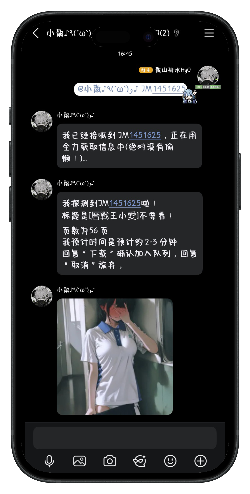
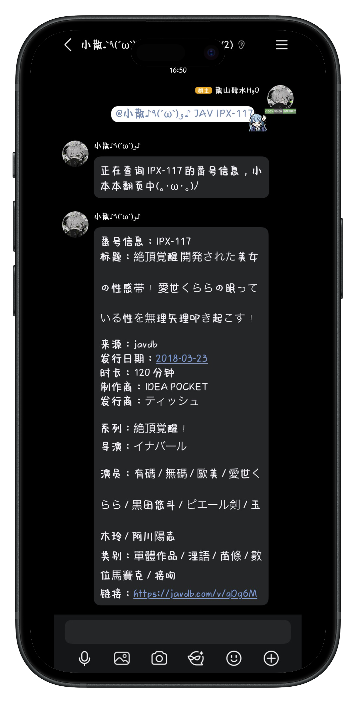
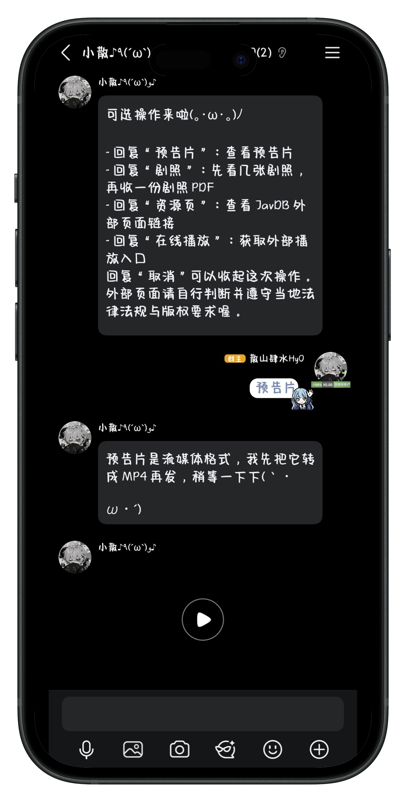
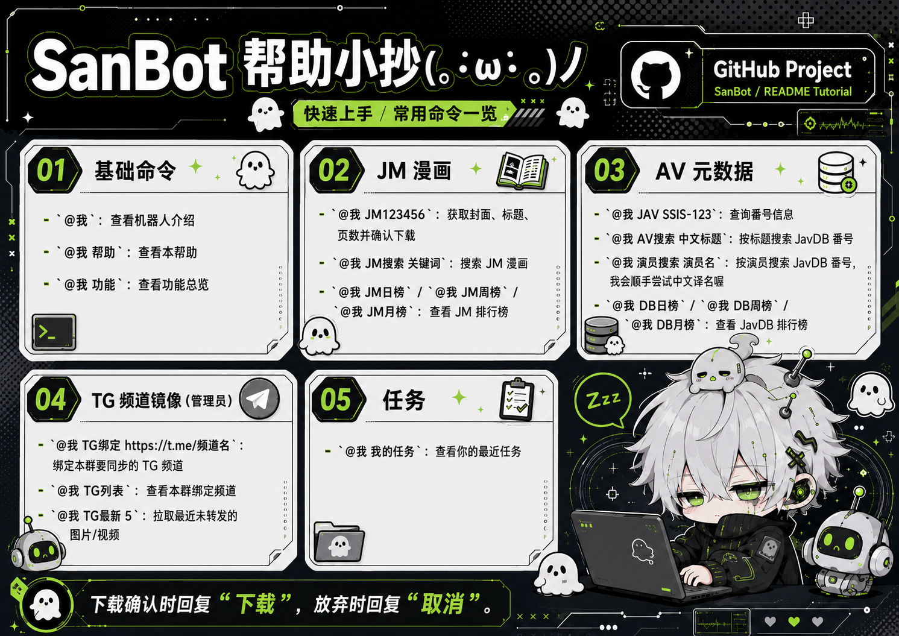

<p align="center">
  
</p>

<h1 align="center">SanBot</h1>

<p align="center">
  <strong>一个可以造福群友的机器人</strong>
</p>

<p align="center">
  基于 NapCatQQ 与 OneBot 11 构建，为 QQ 群提供 JMComic、JAV 元数据与 Telegram 频道镜像服务。
</p>

<p align="center">
  <a href="https://space.bilibili.com/433833099"></a>
  <a href="https://t.me/SanshanHyo"></a>
  <a href="./LICENSE"></a>
</p>

<table>
  <tr>
    <td width="33%" align="center"></td>
    <td width="33%" align="center"></td>
    <td width="33%" align="center"></td>
  </tr>
</table>

<p align="center">
  
</p>

<table>
  <tr>
    <td width="33%" align="center">
      <a href="./docs/tutorial.md"><strong>一键安装</strong></a><br>
      <sub>从一台新服务器开始部署 SanBot</sub>
    </td>
    <td width="33%" align="center">
      <a href="./docs/qa.md"><strong>常见问题</strong></a><br>
      <sub>登录、下载、上传与网络问题排查</sub>
    </td>
    <td width="33%" align="center">
      <a href="./docs/env.md"><strong>配置文件</strong></a><br>
      <sub>功能开关、白名单与环境变量说明</sub>
    </td>
  </tr>
</table>

---

## 功能

### JMComic

- [x] 查询漫画封面、标题与页数
- [x] 下载漫画并转换为 PDF
- [x] 自动拆分并重试上传大文件
- [x] 使用中文关键词搜索漫画
- [x] 查询日榜、周榜与月榜

### JAV Metadata

- [x] 查询番号并返回结构化信息
- [x] 使用中文标题或演员名称搜索
- [x] 查询 JavDB 日榜、周榜与月榜
- [x] 下载并发送 MP4 预告片
- [x] 发送剧照并打包为 PDF
- [x] 按配置提供外部在线播放入口

### Telegram

- [x] 手动拉取指定频道的图片与视频
- [x] 按群记录转发进度，避免重复发送
- [x] 定时静默拉取频道新内容

所有功能都可以在配置中独立开启或关闭，并设置各自的群白名单。高风险入口默认关闭。

---

## 部署

SanBot 提供面向新手的中文安装向导。在 Linux 服务器的 SSH 终端中粘贴一行命令即可开始：

```bash
curl -fsSL https://raw.githubusercontent.com/sanshanhyo/SanBot/main/scripts/install.sh | sudo bash
```

向导中的功能开关只需要输入 `true` 或 `false`。脚本会自动安装 Docker、SanBot 与 NapCat，生成 OneBot 配置和安全 Token，并在最后引导你完成 QQ 扫码登录。

登录完成后运行 `sanbot doctor`，即可检查后端、NapCat、Bot 与预告片转换组件是否正常。

完整步骤请阅读 **[一键安装教程](./docs/tutorial.md)**；需要自行调整功能和白名单时，请查看 **[配置文件说明](./docs/env.md)**。

---

## 致谢

SanBot 的实现离不开这些优秀的开源项目：

- [JMComic-Crawler-Python](https://github.com/hect0x7/JMComic-Crawler-Python) - JMComic 下载与解析能力
- [NapCatQQ](https://github.com/NapNeko/NapCatQQ) - QQ 协议端实现
- [OneBot 11](https://onebot.dev/) - 机器人通信协议

---

## 免责声明

SanBot 仅供技术研究、个人学习与合法的群聊自动化使用，不提供、不托管，也不销售任何第三方内容。项目中的 JMComic、JAV 元数据、外部页面和 Telegram 功能均依赖用户自行配置的数据源或第三方服务；相关内容的可用性、真实性与版权状态不由本项目保证。

使用者应自行确认其行为符合所在地法律法规、平台服务条款和内容版权要求，不得将本项目用于商业盗版、非法传播、绕过访问控制或其他侵权活动。涉及成人内容的功能仅限达到所在地法定年龄的用户使用。

自动化操作 QQ 账号可能触发平台风控或账号限制。使用本项目即表示你理解并自行承担账号、网络、数据与法律风险。项目作者不对因使用或无法使用本软件造成的任何直接或间接损失承担责任。

本项目基于 [MIT License](./LICENSE) 开源。
